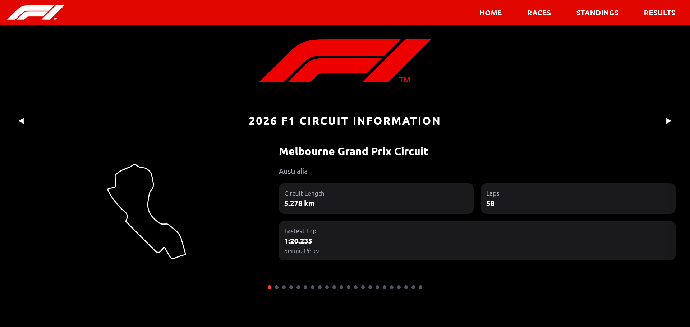
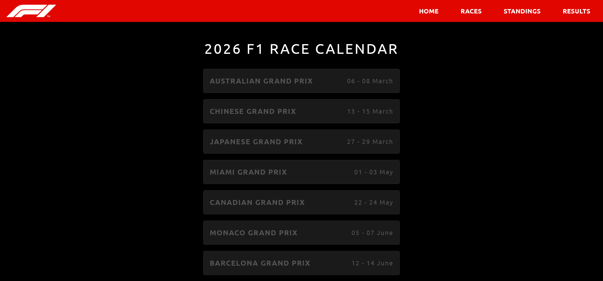
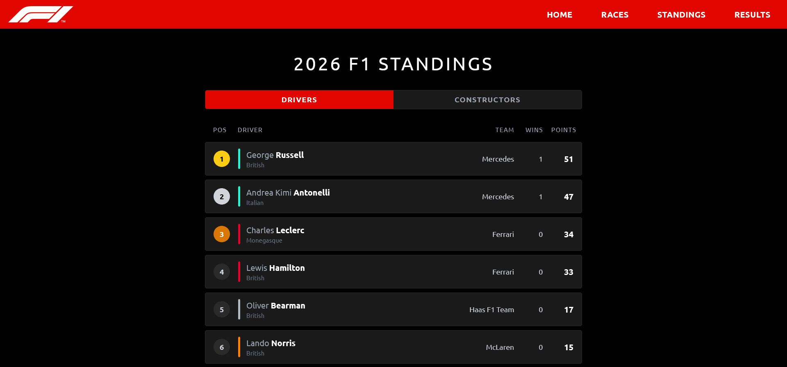

# Formula 1 companion

A MERN based web application which aims to provide information about races during a particular season, constructor and driver details as well as standings. The applications consist of the following modules currently:

- Home page with information about all circuits where races are scheduled in a particular season
- Races page which contains details about all race weekends, including sessions and scheduled session times
- Standings page which consists of the current season's driver and constructor standings

All data presented in this site has been sourced from the jolpi.ca F1 API, cleaned and refactored to fit my use cases.

Live link: https://f1-companion-six.vercel.app/

## Races Page

## Standings Page

Deployment details:

- Backend: Render
- Frontend: Vercel
- Database: MongoDB Atlas

P.S. The results page is currently not implemented

## Tech Stack

- Node
- React
- Tailwind CSS
- Express
- Axios
- MongoDB
